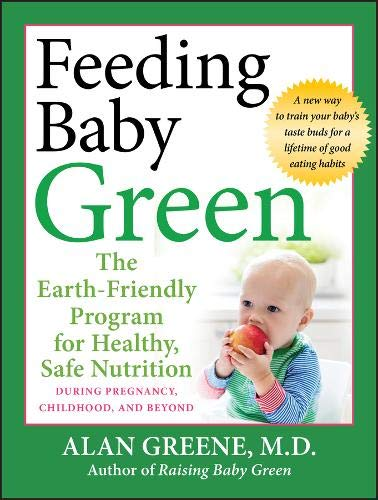
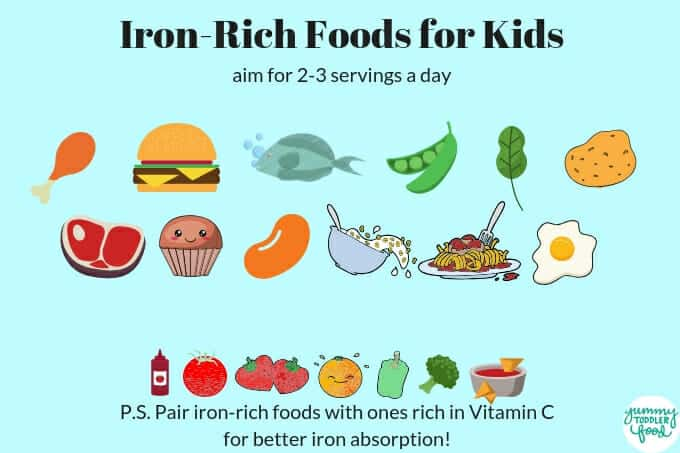
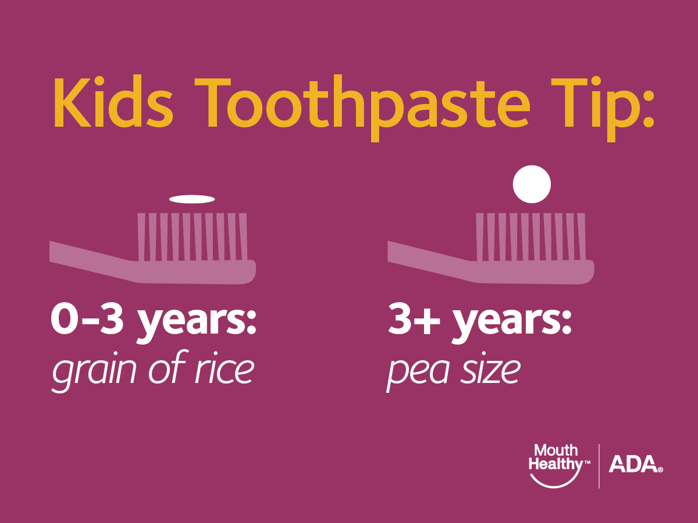

Happy Birthday!

Happy Birthday to You, Happy Birthday to You, Happy 1st Birthday to Your Child, Happy 1st Birthday to You! 12 months is such a momentous time. Your infant is now a toddler and will continue to keep you busy as ever---even more so! I recommend the following changes at 12 months:

## Nutrition

- **If you have been breastfeeding your baby, I recommend continuing until at least age 2**. Breast milk remains a nutritious and immune-rich beverage for your growing toddler. _The [World Health Organization](https://www.who.int/topics/breastfeeding/en/) recommends exclusive breastfeeding until 6 months of age, with "continued breastfeeding along with appropriate complementary foods up to two years of age or beyond."_

- If your baby has been on formula, she no longer needs formula for her nutritional needs. Some parents continue their children on "toddler formulas," but these are not necessary. Toddlers do not need more than about 16 ounces of milk per day, and too much milk can limit your toddler's appetite for solid foods.

- Many parents transition to whole milk at this time. **While whole milk is often touted as a crucial part of a child's diet because it provides fat, protein, calcium, and Vitamin D, it is neither necessary nor healthy for your toddler**. If you choose to give your toddler cow's milk, it's very important to give no more than 16 ounces per day because **too much cow's milk often causes iron deficiency anemia.** Please avoid giving 2%, 1% and non-fat milk until your toddler is at least 18 months old.

- You can also give a multivitamin with Vitamin D and iron. **Toddlers and bigger kids should continue taking a [Vitamin D supplement](https://www.healthychildren.org/English/healthy-living/nutrition/Pages/Vitamin-D-On-the-Double.aspx) through childhood.** If you are not giving an iron supplement, make sure to continue giving your toddler [iron-rich foods](https://thrive.kaiserpermanente.org/care-near-you/northern-california/sanfrancisco/wp-content/uploads/sites/11/2017/01/IronReHandoutToddlers.pdf). Iron is a key ingredient for early brain development.

- Whereas breast milk and formula made up the bulk of your infant's diet (although less so as she approached 12 months), **your 12 month old should be eating mostly solid foods**, and can eat soft versions of the food you are making for the whole family ([just limit the salt!](https://www.cdc.gov/vitalsigns/children-sodium/index.html)). Many families transition from breast milk (or formula) to cow's milk at this time, but **CHILDREN DO NOT NEED TO DRINK COW'S MILK.**

- Toddlers (and kids) also DO NOT NEED special "kid food" although the food industry would like you to think they do... It's MUCH healthier to give your baby steamed carrots rather than a [fruit/veggie pouch](https://www.ohbabynutrition.com/blog/the-dark-truth-about-puree-pouches) or baby teething cookies (which have added sugars). I also recommend limiting or avoiding juice since it has [a lot of sugar](https://www.drnadiv.com/sugar/).

- Feed your toddler a rainbow of fruits and vegetables and other fresh foods. Feeding Baby Green is a great book for more information!

Some babies try a food 15 times before they will accept it!! So keep trying! Taste buds are pretty well established by age 2, so **get those varied flavors into their diets early and often!!**

- [Parents are in charge of what to serve for meals and children choose when and how much to eat](https://www.drnadiv.com/veggies/). A typical toddler will have a solid meal every three days, so don't worry if your toddler doesn't eat three solid meals and two snacks per day! **Let your child decide how much to eat.** He won't starve--I promise! Toddlers and young children [know how much food they need](https://www.npr.org/sections/thesalt/2016/02/04/465305656/in-babys-first-bite-a-chance-to-shape-a-childs-taste), and often eat less if they feel pressured. It’s also important to avoid distractions during meals, allow your toddler to feed himself, and be ready for a mess! That’s part of the fun of being a toddler :-)

- 12 months is also the time to start weaning your toddler off the bottle and pacifier since they [promote tooth decay](https://www.healthychildren.org/English/ages-stages/baby/teething-tooth-care/Pages/How-to-Prevent-Tooth-Decay-in-Your-Baby.aspx). I know this is not easy for many families, but the earlier you attempt to stop the bottle, the easier it will be. You may provide liquids via a straw or regular cup. I like the 360 toddler cups, which allow toddlers to use a "regular" cup with less spilling.

## Dental Health

- While we are talking about healthy teeth, please continue to **brush your toddler’s teeth with a tiny amount of fluoride-containing toothpaste (think a grain of rice).** Parents often ask me when their toddler should see a dentist. The answer is “it depends.” [The AAD recommends that babies see the dentist after the first tooth comes in or no later than his/her first birthday](https://www.aapd.org/resources/parent/faq/). In practice, though, some dentists will not see babies in their practice, and some pediatric dentists advocate waiting until 2 and a half years old to begin dental check ups. The most important piece of seeing a dentist early is to learn how to prevent tooth decay and apply a fluoride varnish. I offer a [fluoride varnish](https://mydoctor.kaiserpermanente.org/ncal/Images/Protect%20Your%20Child's%20Smile_tcm75-905119.pdf) to toddlers at 12 months, and then every 6 months until they are seeing a dentist twice per year.

## Development

- [Wondering about your baby's development? Healthy Children is a great source of reliable information](https://healthychildren.org/English/ages-stages/baby/Pages/Developmental-Milestones-12-Months.aspx)
