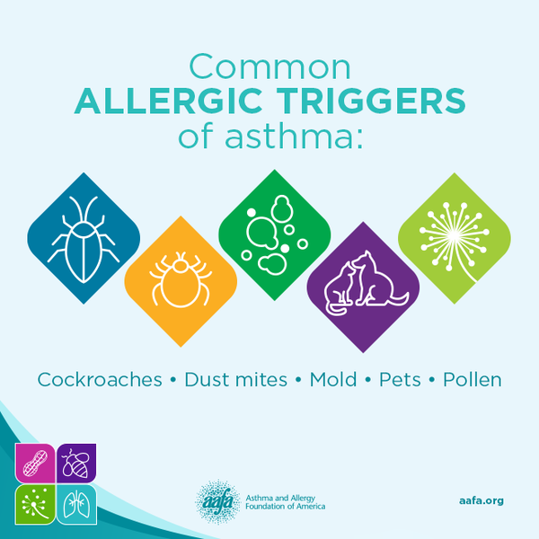

# All About Environmental Allergies

Nasal allergies are very common, and the **most common cause of
morning stuffy nose is an allergy to dust mites (especially if the symptoms are present year
round).** 

Other symptoms of allergies include sneezing, clear runny nose, throat clearing, itchy/watery eyes, itchy nose, and cough. With allergies, the cough is usually dry and is often worse at night. Allergies are a common trigger of asthma---it's important to control nasal allergies if they are causing a child to have wheezing, shortness of breath, and/or coughing fits. 

If you child starts coughing and sneezing starting in around March/April when the weather warms up, he/she may have "seasonal allergies."  Some of these children benefit from taking allergies medicines (i.e.: cetirizine, flonase) daily during the warm months of the year.  

If you suspect your child has allergies, pay attention to any clear triggers and then modify your environment accordingly. 

If your child continues to have troublesome symptoms (such as nighttime cough, ear pain or hearing issues), I recommend giving allergy medicine daily.  Allergy medicines include nasal steroids (such as flonase) and/or oral non-drowsy antihistamine (zyrtec, claritin, allegra, etc) daily. Benadryl is also an oral antihistamine, but makes children drowsy and only lasts 4-6 hours.

To learn how to give your children over-the-counter allergy medicines, please see this [guide](https://mydoctor.kaiserpermanente.org/ncal/article/index.html?article_id=1278756&co=%2Fregions%2Fncal)

[Overview of Allergy Symptoms, Treatment, and Prevention](https://mydoctor.kaiserpermanente.org/ncal/structured-content/Condition_Allergic_Rhinitis_in_Children_-_Pedi_Allergy.xml?co=%2Fregions%2Fncal)

See more detailed information and videos from the [Asthma and Allergy Foundation of America](https://www.aafa.org/) and the [American Academy of Allergy Asthma and Immunology](https://www.aaaai.org/)
