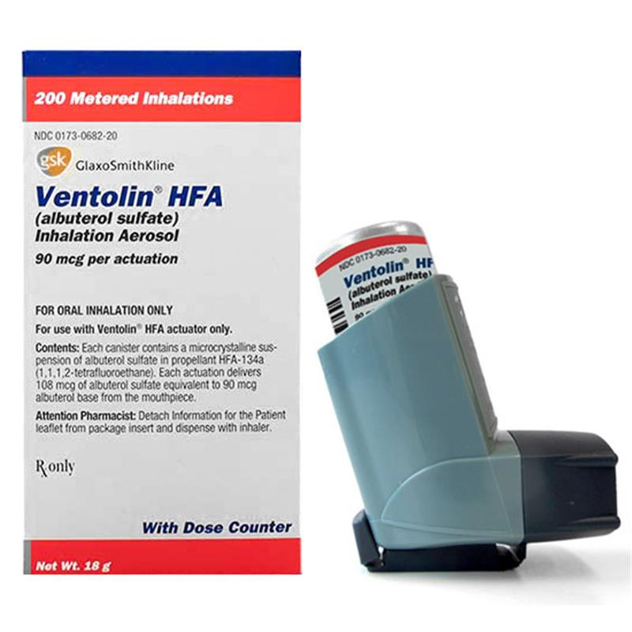
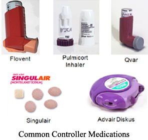
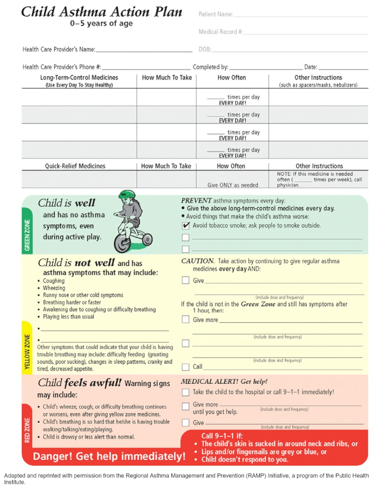
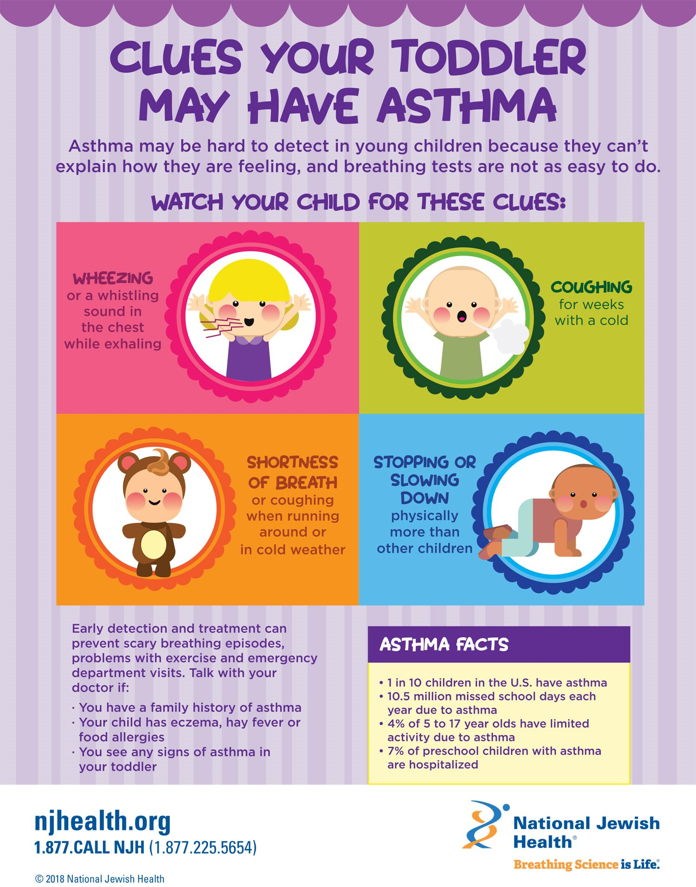
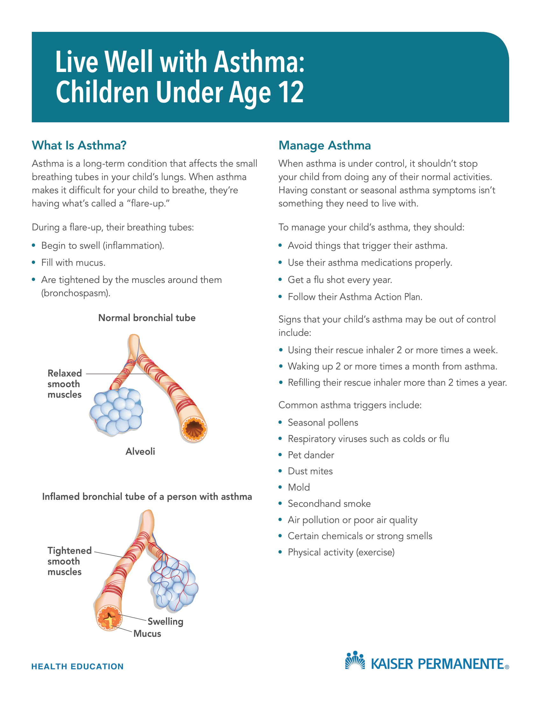
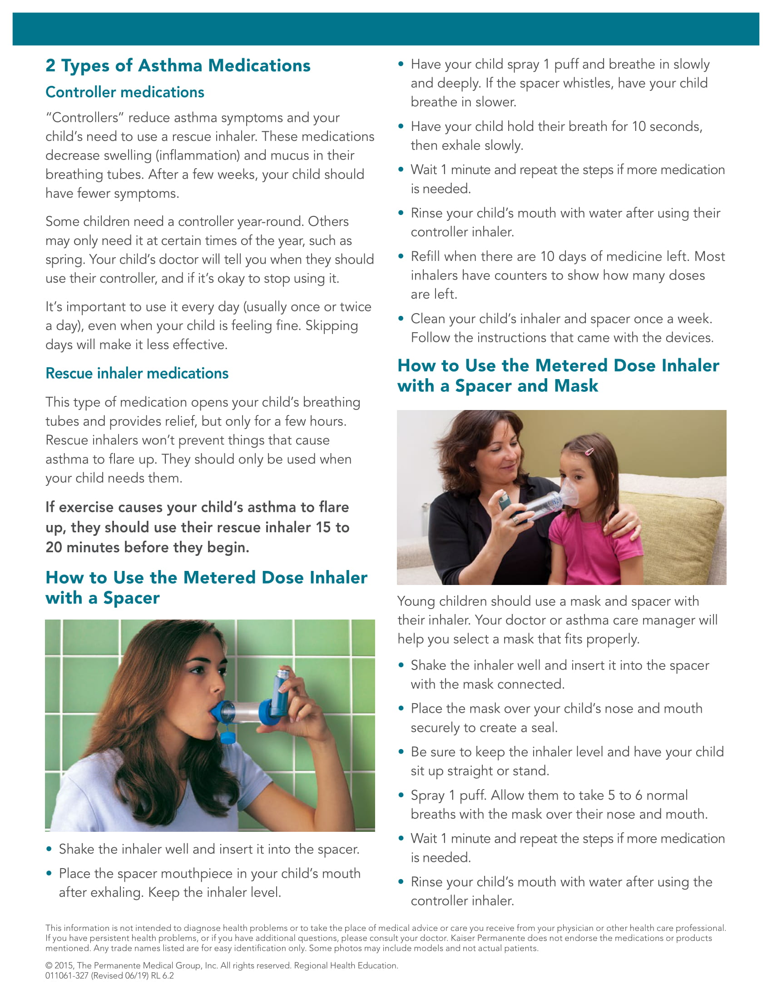
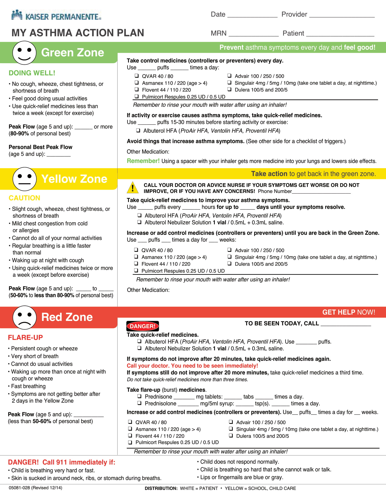
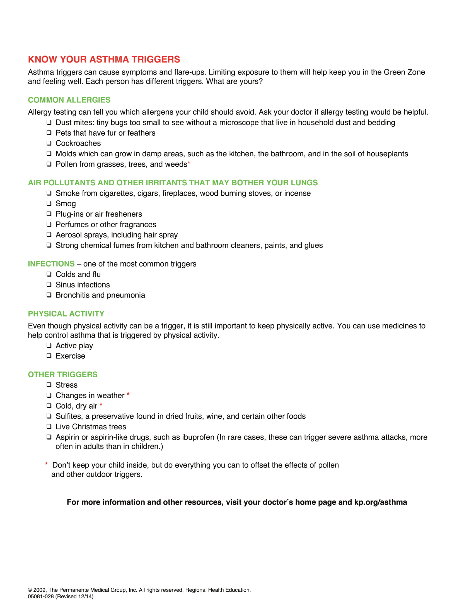

## Living With Asthma

Asthma is very common and is often underrecognized. To make life more complicated, not all children who wheeze have asthma, and children can have asthma without wheezing (cough-variant asthma). Kids often grow out of their asthma. And most of the children I treat have **intermittent asthma symptoms** that are triggered by viral infections, allergies, or exercise. I spend A LOT of time discussing asthma and inhaler use.

## Medicines Commonly Used To Treat Asthma, And How They Work

* ### Albuterol (Ventolin, Pro-Air) is a **RESCUE MEDICINE** that works quickly to open up tight airways, but only lasts for a few hours. 
  * **SHOULD NOT BE NEEDED ON A DAILY BASIS!!**

  
* ### Inhaled Corticosteroids (Flovent, Alvesco, Qvar, etc) are **CONTROLLER MEDICINES** that work more slowly but are longer lasting. They should be taken twice daily as directed by your doctor.  Some children take these medicines for 2 weeks at a time when asthma symptoms act up. Other children take these throughout the winter/cold season, and some take them year round. Many parents worry about the side effects of these medicines, but they are **[VERY SAFE](https://www.chop.edu/health-resources/safety-steroids-asthma)**

* ### Singulair (Montelukast) = **CONTROLLER MEDICINE** that is not a steroid. It is a "mast cell inhibitor."

### Please Watch this AMAZING video to learn more!

`youtube: https://www.youtube.com/watch?v=Et_alsghel8`

#### Sample Asthma Action Plan

### Could My Toddler Have Asthma? 

---

