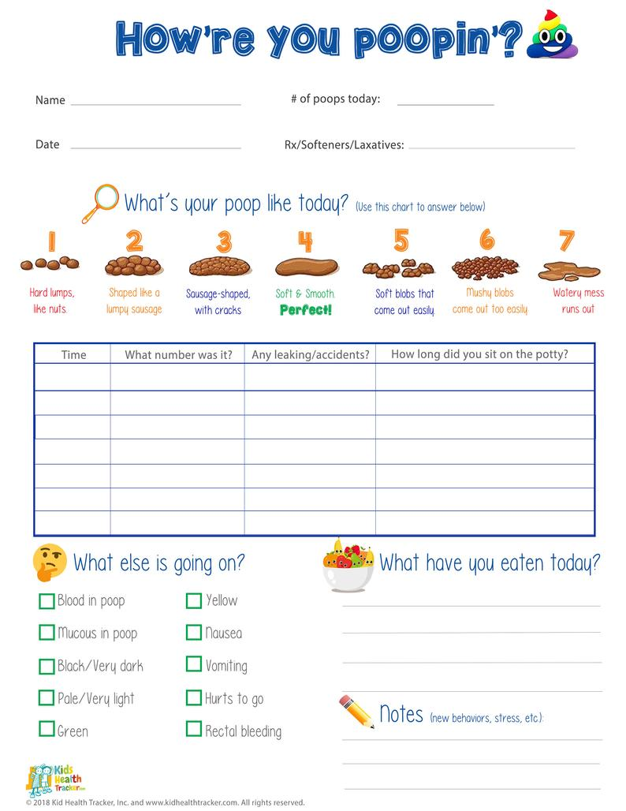

The ubiquity of refined processed foods, "kid's meals," and "picky eaters" often leads to constipation. **Many children have hard or painful poops and/or strain to have a bowel movement. Over time, this can cause a variety of medical issues including abdominal pain, stool leakage (encopresis), bladder infections, bed wetting, and anal fissues/hemorrhoids.**

When this is a concern, I always counsel parents to keep a "poop diary"---gross, I know, but it really helps! Knowing how often your child is pooping and what it looks/feels like can help stay on top of any constipation issues. 

# **How To Manage Constipation**

* Minimize constipating foods:
  * Give no more than 16 ounces of milk per day.
  * Bananas, white rice, white bread, bagels, pizza, cheese, ice cream can also be constipating

* Drink plenty of water and eat plenty (9 servings!) of fruits and vegetables every day.  Prunes and pears often work great:  Try 2-3 prunes daily to start (dried or pureed).

* Fiber:  Ground flax seed or Benefiber:  1/2-1 tablespoon twice daily, mixed with food or drink. Increase or decrease the dose as needed to achieve about 1 soft stool daily.  Ground flax seed can be purchased at most supermarkets, and Benefiber at most pharmacies. 

* If this does not work, ask your doctor if your child can try Miralax or another laxative. 

`youtube: SgBj7Mc_4sc`

## Helpful Websites and More Information
* [Tips from Pediatrics GI Doctors](https://gikids.org/constipation)
* [Healthy Children Constipation Summary](https://www.healthychildren.org/English/health-issues/conditions/abdominal/Pages/Constipation.aspx)
* [KP My Doctor Online Constipation Summary](https://healthy.kaiserpermanente.org/northern-california/health-wellness/health-encyclopedia/he.constipation-in-children-care-instructions.ut1883?kpSearch=constipation)
