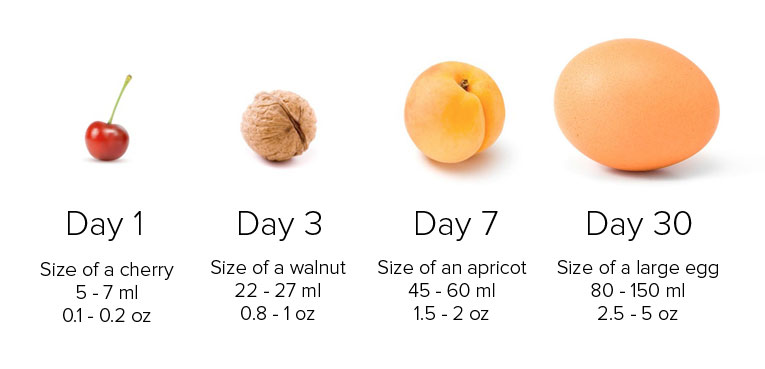
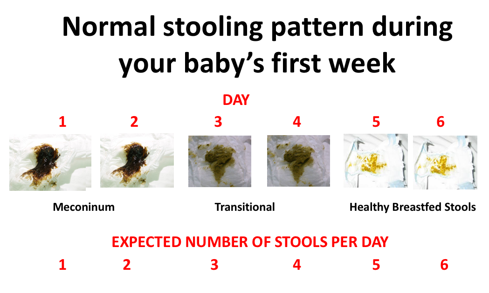
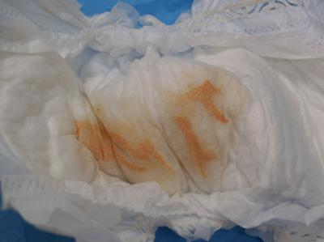
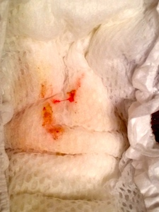

Newborns are undoubtedly **terrifying**, especially if you are a **first time parent**.   Everything is so **NEW**: day-night reversal, pimply/greasy skin, endless gas, noisy breathing, why do they need so much sleep?!

[I recommend that all first time parents check out this **Kaiser Video Series For New Parents**](https://mydoctor.kaiserpermanente.org/ncal/healthtools/#/?id=935218)

## A Few Fun Facts

* Newborns are noisy! It's normal for newborns to hiccup, sneeze, and sound congested in their noses (they have tiny nostrils!). As long as a baby's stuffy nose isn't interfering with feeding (like you baby pulls off the breast to catch his breath), and your baby is otherwise looking comfortable, we don't worry about these noises

* Newborns also have dry/peeling skin and develop several different types of rashes. Most of these are normal.  [This website has a comprehensive collection of photos of these types of rashes (and more!)](http://med.stanford.edu/newborns/professional-education/photo-gallery/skin.html)  

* The [umbilical cord](https://www.mayoclinic.org/healthy-lifestyle/infant-and-toddler-health/in-depth/umbilical-cord/art-20048250) falls off in the first couple of weeks of a baby’s life, on average at around 10 days of life. Once the cord falls off, it's safe to give your baby a bath. 

* [Umbilical hernias](http://www.childrenshospital.org/conditions-and-treatments/conditions/u/umbilical-hernia) are quite common, and as long as you can reduce them, most doctors recommend observing until kids are ready for kindergarten at which point it may make sense to correct it surgically

* Newborns don’t get very dirty, so you don’t need to bathe them more than 1-2 times per week
 
* [Size of your newborn's stomach](https://www.lllc.ca/thursday-tip-newborns-have-small-stomachs)

- **It’s important to feed a newborn every 2-3 hours around the clock at least until she has regained her birth weight**. After that point, I advise my families to wake and feed their baby every 2-3 hours during the day, but allow baby to wake them up at night (it's ok to go longer stretches at this point).
* [All About Breastfeeding](https://www.llli.org/)

- **Newborns need A LOT of sleep!** Parents often tell me that their baby cries often at night, and doesn't sleep much (or at all) during the day. Newborns get overtired if they are awake for more than 45 minuntes to an hour at a stretch. But since your baby won't tell you he's tired (or yawn or rub his eyes), you need to watch the clock and make sure to put your baby to sleep after no more than one hour of awake time (often it is less!). This is not intuitive, but I have found paying attention to newborn sleep to be very helpful both as a mother and a pediatrician! [Check out this sleep consultant blog post for excellent tips!](https://www.weebeedreaming.com/my-blog/category/Newborns)

- **You can tell a lot about a newborn from her poop and pee**

 * Baby poop is black and sticky at first: this is called meconium 
 * Once babies start drinking milk (breast or formula), their poop will start to “transition” first to brown, and then to green, and ultimately to yellow (in the case of breast fed babies).
 
 * Breast fed babies have yellow, mustardy, seedy poops, and after the first week or so, parents can expect 6-8 of these poops per day
 * By around 6-8 weeks of life, a baby’s GI system becomes more efficient at absorbing nutrients, and it’s not unusual for a baby to have one poop per week.  Some continue to poop many times per day. As pediatricians, we don’t tend to worry how often baby is pooping as long as the poop is soft
 * Poop comes in all shapes and colors and is different based on whether the baby is drinking breast milk or formula and [the balanced breast milk your baby is drinking](https://www.llli.org/breastfeeding-info/foremilk-and-hindmilk/). When babies are having a lot of green frothy poops, this is often due to an excessive amount of foremilk, which can happen if the baby feeds for a shorter period of time per breast and isn’t drinking the fatty hindmilk.
 * In general, we don’t worry about poop unless it is very watery, white, red, or black

## Baby Pee, What to Expect

* One pee pee diaper per day per age of life for the first 5 days 
* In the first week of life when babies are still losing weight, we often see orange/red crystals in the diaper, and these are common in slightly dehydrated babies. They are called urate crystals and will go away once the baby is getting more milk

Other fun diaper finds! 
 - It’s also ok for newborn girls to have a mini-period (some blood in their diaper) in the first week of life 

   
* [TPMG's Guide To Newborn Care](https://mydoctor.kaiserpermanente.org/ncal/structured-content/#/Health_Topic_Newborn_Care_Bathing_and_Changing_Your_Baby_-_Pediatrics.xml)

## References
* [Common birthmarks](https://www.healthychildren.org/English/ages-stages/baby/bathing-skin-care/Pages/Your-Newborns-Skin-Birthmarks-and-Rashes.aspx)  
* [Sleep Needs](https://www.healthychildren.org/English/healthy-living/sleep/Pages/Healthy-Sleep-Habits-How-Many-Hours-Does-Your-Child-Need.aspx)
* [Vaccines for Parents and Other Caregivers](https://www.cdc.gov/vaccines/pregnancy/family-caregivers/index.html)
* [Cradle Cap](https://www.healthychildren.org/English/ages-stages/baby/bathing-skin-care/Pages/Cradle-Cap.aspx)
* [All About Jaundice](https://www.healthychildren.org/English/ages-stages/baby/Pages/Jaundice.aspx)
* [Safe Sleep](https://www.healthychildren.org/English/ages-stages/baby/sleep/Pages/A-Parents-Guide-to-Safe-Sleep.aspx)
* [The Fussy Baby](https://www.healthychildren.org/English/ages-stages/baby/crying-colic/Pages/Calming-A-Fussy-Baby.aspx); [The 5 S's](https://www.youtube.com/watch?v=a_64-LbhT3M)
* [FPIES](https://www.kidswithfoodallergies.org/food-protein-induced-enterocolitis-syndrome-fpies.aspx)
* [More from AAP Healthy Children.org](https://www.healthychildren.org/English/Pages/default.aspx)
* [Healthy Kids Healthy Futures Handouts](https://mydoctor.kaiserpermanente.org/ncal/structured-content/Health_Topic_Well_Child_Visits_Birth_to_12.xml?co=%2Fregions%2Fncal)
* [Normal Infant and Toddler Development](https://mydoctor.kaiserpermanente.org/ncal/structured-content/#/Health_Topic_Infants_Toddlers_-_Normal_Growth_Development_-_Staying_Healthy.xml)
* [Baby 411: Handy Reference Book Written by a Pediatrician](https://baby411.com)
