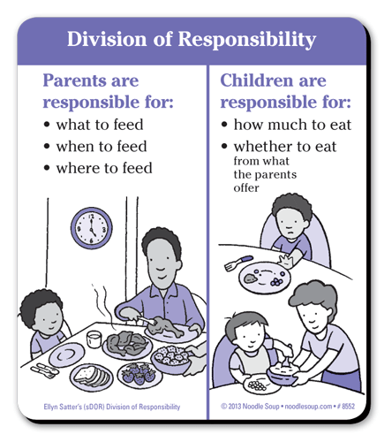
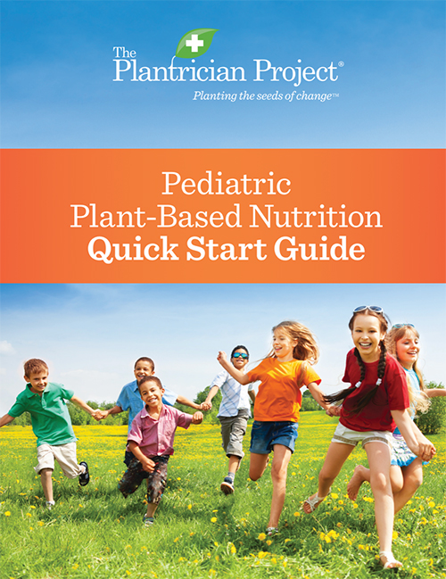

In my last two posts, I talked about how eating whole plant-based foods is best for our bodies and the planet, but many parents worry that their children won't try new foods. As a mother of two young children, I know it can be challenging to get your kids to eat and enjoy healthy foods. The key, however, is to focus on the [division of responsiblity when it comes to feeding.](https://www.drnadiv.com/veggies/) 

### How can I get my kids excited about trying new foods?

* Get kids involved: farmers' market outings, cooking as a family, becoming acquainted with vegetables in a playful setting (see [Adventures in Veggieland](https://www.amazon.com/Adventures-Veggieland-Vegetables_with-Activities-Recipes/dp/1615194061) for details and fun activities to try with your kids!
* Talk to kids about the reasons behind a plant based diet (take care of the earth, keep our bodies healthy). There are several wonderful childrens' books that can facilitate this discussion with your children
* Look at recipes with your kids and involve them in deciding which foods to make
* Start where they are by giving more of the healthy foods your children already like
* Role model healthy eating and trying new foods

### How will I ensure that my kids are getting enough calcium, protein, and all other necessary vitamins and minerals?

* Eat a rainbow of fruits and vegetables every day
* **Eat protein and iron rich foods with every meal**
* Eat whole grains (whole wheat bread, brown rice, whole grain or legume-based pasta)
* Limit refined grains such as white bread, pasta, rice, sugary foods, and highly processed foods
* If you are feeding your children exclusively plant-based foods, **give a supplement of Vitamin B12 and iodine** (unless you use iodized salt)
* Take a **Vitamin D supplement and enjoy the SUNSHINE**
  
  
## HELPFUL RESOURCES
  
* [_Nourish_](https://nourishthebook.com/) is a recently published book (November 2020) written by a pediatrician and a dietician that very thoroughly describes the myriad benefits of eating more plant-based foods, explains the evidence behind their recommendations, provides clear dietary guidelines and includes a section with recipes.
   
`youtube: 8Y8-V2BexxI`
   
* [Pediatric Plant-Based Nutrition Quick Start Guide](https://plantricianproject.org/quickstartguide) is a briefer informational guide written by pediatricians and dieticians discussing the health benefits of a plant-based diet with practical tips on how to feed your children, also including recipes. 
 

 
* [The Physicians Commitee for Responsible Medicine](https://www.pcrm.org/good-nutrition/nutrition-for-kids) on good nutrition for kids

`youtube: 1lix5tz3Yys`

* [Veggie Doctor Radio Podcast](https://veggiedoctor.libsyn.com/) is an upbeat, educational podcast featuring Washington-based pediatrician [Dr. Yami](https://www.doctoryami.com/) and a wide range of guests. 
 
* [Plant Based Pediatrician: Jackie Busse, MD](https://www.plantbasedpediatrician.com/) has an [extensive list](https://www.plantbasedpediatrician.com/resources-2) of resources about plant-based nutrition
 

**In addition to these online resouces, I am here to support and guide you along the way.**  

**As Hippocrates famously said, “_Let food be thy medicine and medicine be thy food_.”**
