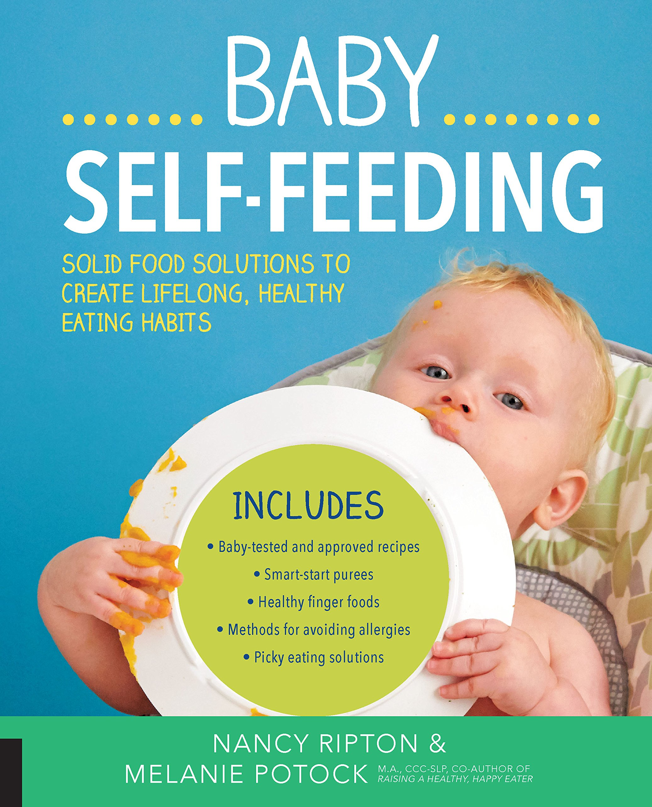
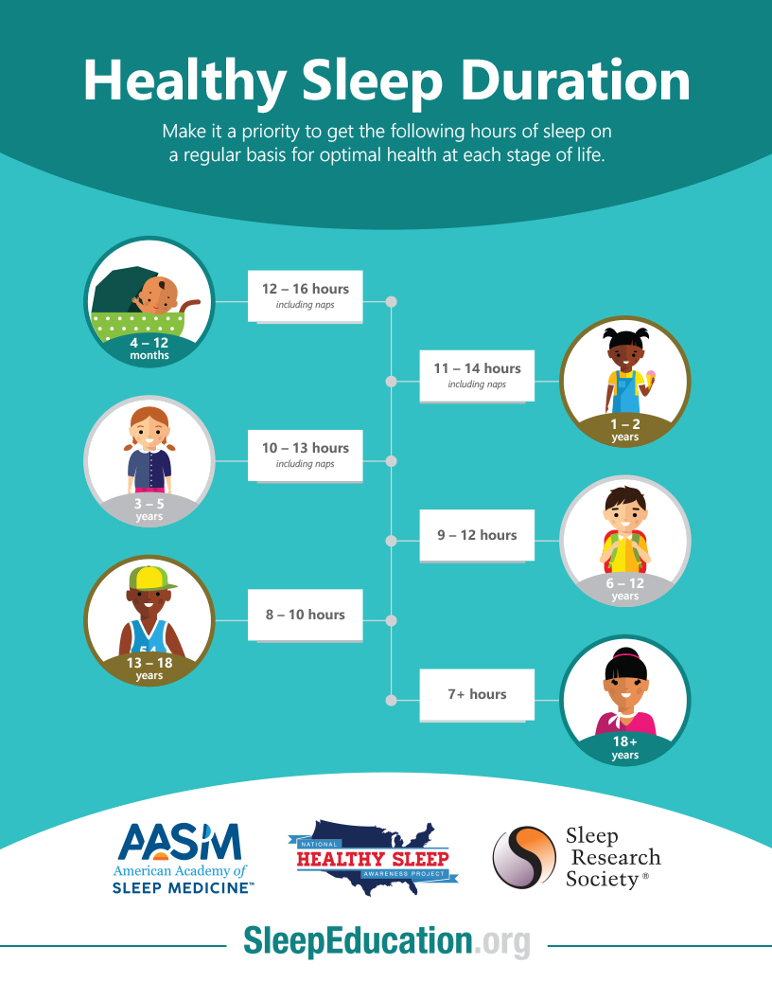

Your 6-month-old is ready to explore eating, can sleep on his/her own, and is going to start moving soon (if s/he hasn’t already!). The next several months are busy and exciting. Read more about how to encourage your baby’s development!

##Nutrition

[It's time to start your baby on solids if you haven't already!](https://cl.kp.org/ncal/home/refcontainerpage.dam.html?damrefpath=/content/dam/clinicallibrary/ncal/clib/health_education/region/96440.pdf&q=solid%20food&context=searchkp)  I recommend starting with different vegetable and fruit purees, but you can also give ground meats early on (a great source of iron).  Be sure to incorporate iron rich foods (fortified baby cereal, lentils, beans, tofu, leafy greens, meat) early on especially if you have been exclusively breastfeeding!

[Check out pediatrician and healthy eating advocate Nimali Fernando’s detailed blog post on starting solids and how easy it is to make your own baby food!](https://doctoryum.org/baby-feedin-making-homemade-baby-food/)

I also really like [Melanie Potuck](https://mymunchbug.com/)’s book for an overview of how to set your baby up for lifelong healthy eating habits!

Babies are more likely to accept new flavors between 6-7 months of age, so I recommend plenty of variety early on! Please also start offering your baby a cup with tap water now. 

Babies don't need to eat rice cereal as the first food or ever. Rice cereal is a convenient source of iron, but it can be constipating and teaches babies to like processed white foods (white bread, etc), and that may predispose to obesity later in life.  I prefer iron-fortified barley cereal or oatmeal. And as I mentioned above, you can also feed your baby lentils, beans, tofu and leafy greens! Please don't add salt or sugar, and stay away from honey and cow's milk until one year. 

You also don't need to wait 3-5 days between each new food. **Variety is key!** Try to introduce as many different foods in the first year as possible. When you are introducing foods that are common allergens (soy, milk, egg, fish, wheat, peanut), wait 1-2 days before introducing the next possible allergen. 

 

**Make sure to start finger foods after 1-2 months of purees!** Finger foods include small, soft pieces of scrambled eggs, shredded cheese, soft pieces of fruits, vegetables, beans, tofu, lentils, cottage cheese, whole milk plain yogurt, thinly spread peanut butter on soft bread, and [Bamba](http://en.wikipedia.org/wiki/Bamba_%28snack%29) (peanut butter puffs).  When deciding when to offer your baby finger foods, there are a few considerations.

* Your baby should be able to “chew” using his/her gums to mash foods 
* Your baby can sit up unassisted. A baby eating finger foods is more likely to choke and being reclined or supported may only increase this risk.

You only need to feed your baby 1-2 times a day at first, increasing as s/he gets closer to 9 months.  And let your baby decide how much to eat; it may be a teaspoon or a whole bowl.  **Don't force him/her to eat after s/he loses interest.**  

**PLEASE DO NOT GIVE YOUR BABY JUICE. JUICE IS NOT HEALTHY**. I also recommend limiting processed baby food pouches and snacks as they are sweet and do not prepare your baby to eat different textures. 

From 6-9 months, continue to give your baby milk first, but starting at around 9 months of age, s/he can have solids before milk.  By 12 months, s/he should be eating three meals and two snacks per day.  Have fun with this new stage!!

##Sleep
By around 6 months (although this can be a little later for exclusively breast fed babies), your baby is capable of sleeping for 12 hours straight at night, and does not need nighttime feedings anymore.  If your baby is feeding at night, s/he is likely a [**trained night feeder**](https://drcraigcanapari.com/learned-hunger-nighttime-feeding-stop-night-feeding/).  
 
Now is the time to say goodbye to the pacifier.  Your baby needs to be able to fall asleep on his own (i.e., no binky, no bottle, no breast, no rocking, etc)!!  **All healthy 6 month olds CAN fall asleep on their own!**  

Set up good sleep habits NOW! And make sure your baby, toddler and child gets enough sleep. Babies and children need more sleep than adults!

 

If your baby is not sleeping enough, try to move bedtime earlier. Most babies and children should go to bed between 6:30-7:30 pm! Kids need a LOT of sleep!

##Teeth
Some babies get teeth as early as four months, and some as late as 12 months (or later), but most get their first tooth at around 6-7 months.  Once your baby has teeth (even one), please start brushing it/them twice per day using a tiny smear (the size of a grain of rice) of fluoride containing toothpaste.  

Drinking 4-6 ounces of tap water per day is also good for her teeth.  She should have her first dental visit between 12-24 months.  At her 12 month well check, we will offer your baby a fluoride treatment to protect her teeth.  We recommend doing this treatment every 6 months (either in our office or with your dentist).   

##Development
Studies show that babies do not learn when they are passively watching a program on the television or a computer/tablet/smart phone.  **In addition, data is mounting that EARLY EXPOSURE TO TV PROGRAMS (EVEN BABY EINSTEIN) can increase the risk for attention problems in the future, such as Attention Deficit Disorder.** 

For more information, please check out this video. `youtube: https://www.youtube.com/watch?v=BoT7qH_uVNo`

Read to your baby every day.  Give him lots of floor time with new and interesting toys.  Take him to the park, library, etc.  Think about joining a playgroup, so he can interact with other babies his age.  

**MAKE SURE YOUR BABY IS GETTING ENOUGH SLEEP**

##Safety
Your baby is going to be mobile before you know it!  And once she starts to move, there will be no stopping her! 
**Program the [Poison Control Number](https://www.poison.org/18002221222) into your phone 1-800-222-1222 now!**

### [Childproofing](https://www.parents.com/toddlers-preschoolers/safety/toddlerproofing/home-safe-home-childproof-your-home-room-by-room/) and constant supervision are essential!
  * toilet locks 
  * gates to prevent injuries from falling down stairs, etc
  * cabinet locks
  * window locks
  * securing heavy bookcases, televisions, dressers, etc
  * electrical outlet covers
  * cover sharp corners
  * check ties on blinds and curtains (http://www.windowcoverings.org/)
  * lead awareness
  * ask visitors to put purses/etc out of reach

* [Remember sun safety](https://pedsderm.net/site/assets/files/1028/spd_sun_protection_color_web-2_final.pdf)
  
* **Watch out for choking hazards and learn infant CPR! 

`youtube: ksLwSIUljP4`

* NEVER LEAVE YOUR BABY IN THE BATHTUB ALONE
* **Car safety: your baby should stay rear facing until he is at least 2, longer if possible**
* Air quality and fire safety
  * Install carbon monoxide detectors, smoke alarms in all rooms
  * Have at least one, ideally many fire extinguishers at home
  * Consider radon testing (radon is an odorless gas)

