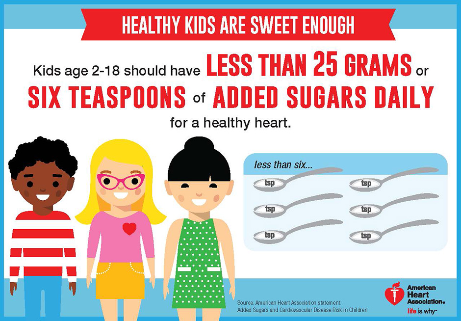

My daughter often comes home complaining that other kids have yummier lunches than her (granola bars, cookies, juice, etc). And I know the pain of packing a wholesome lunch and having it come back untouched. It’s so hard to avoid the ubiquity of processed, sugar-laden foods--they are everywhere and we eat WAY too much of them!

I am a big fan of [That Sugar Film](https://thatsugarmovement.com/), [Fed Up](http://fedupmovie.com/), and Michael Pollan’s [In Defense of Food](https://www.imdb.com/title/tt4785640/).

Pollan really says it best: **“Eat Food. Not Too Much. Mostly Plants.”**

The American Academy of Pediatrics recommends the following:

- Children under age 2 should not have any added sugars
- Children 2 and over should have **no more than** 25 grams (6 teaspoons) daily

Most younger children should actually have less than this, no more than 5% of their [total energy intake (which varies based on age/sex/activity level)](https://health.gov/dietaryguidelines/2015/guidelines/appendix-2/). So a two-year-old who eats 1000 calories per day should have no more than 50 calories from sugar:

- 1 gram sugar = 4 calories
- Max sugar intake for 2 year old = 12.5 grams = ~ 3 teaspoons

Most American children eat more than three times the recommended limits. Some of this excess comes from sweets like soda, candy, cookies and ice cream. But a lot of it comes from processed foods that we perceive as healthy, like **granola bars, children’s cereal, flavored yogurt, juice, pasta sauce, salad dressings, and many bread products.**

**In addition, refined white carbohydrates (white rice, white bread, bagels, pasta, etc) are quickly converted into sugar once we eat them, so they don’t fill us up and contribute to our total sugar intake.** Sadly, this is what most of our kids eat. Look at any “Kids’ Menu” and you will see the pattern:

- Pizza → white carbs + sugary pizza sauce
- Mac N Cheese → white carbs + processed “cheese” sauce
- Hamburger and fries → white carbs + red meat + sugary ketchup + fried potatoes

Don’t forget the juice that comes with the meal, and the dessert at the end.

Many parents tell me that their children don’t like to eat vegetables. Well, when given the choice between broccoli and pizza, I’m not sure how many children would choose broccoli. But when parents offer healthy foods early and often and persist even when their kids protest, their kids can learn to like vegetables, whole grains, and unsweetened snacks and drinks.

Here are a few ideas to help encourage healthy eating:

1. Have family meals where everyone eats the same foods
1. Parents choose what to serve and when to offer meals and kids choose when and how much to eat
1. Get kids involved in shopping, preparing and cooking food
1. Make it an adventure! Check out [Adventures in Veggieland](https://www.amazon.com/Adventures-Veggieland-Vegetables-Activities-Recipes-ebook/dp/B06XPQQQ7P/)

My eight-year-old daughter and I have an ongoing conversation/negotiation about her added sugar intake. She knows how to read labels and can tell which foods are healthy. I recommend doing this with your kids, too, and figure out how to make small changes to keep their (and your) sugar intake at a healthy level.
