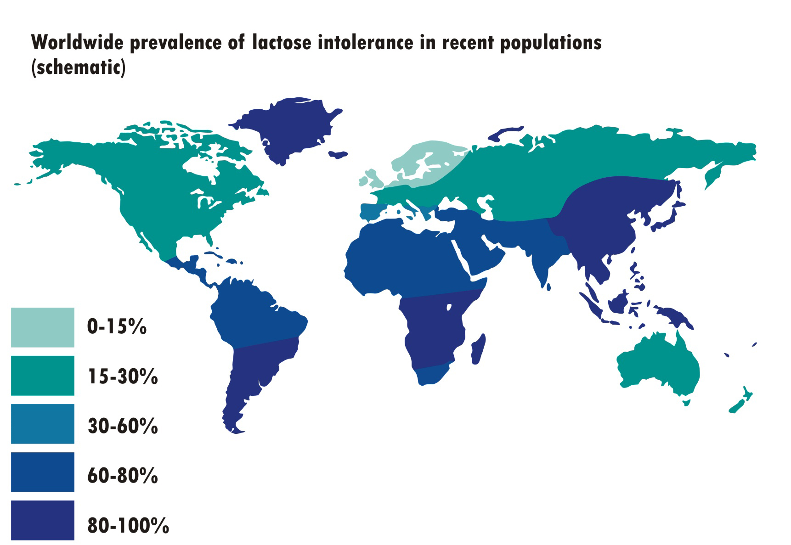

**The BEST GIFT we can give our children is healthy nutrition from the start! I am a pediatrician because I strongly believe in prevention, and healthy nutrition is the best way to set our children up for healthy lives as adults**.  Habits start when children are young, and taste preferences form in infancy. I love being able to speak to parents about [starting their babies on solids](https://www.drnadiv.com/6-to-12-months/).  If babies and toddlers grow up eating a wide variety of healthy foods, they will continue those habits throughout their lives.  

In this post, I'd like to share the health benefits and safety of plant-based diets for children. Many of my patients, particularly adolescents, are not eating enough fruits and vegetables.  Many children in my practice have high cholesterol, prediabetes, and [non-alcoholic fatty liver disease](https://www.the-nash-education-program.com/what-is-nash/). These are the children who will be at higher risk for ultimately developing heart disease, diabetes and liver problems. These conditions are related to the Standard American Diet (SAD). The Standard American Diet includes frequent consumption of animal foods (meat and dairy), highly refined grains (white breads/pancakes/waffles/bagels, pasta and rice) and ultra-processed and sugary foods (chips, sugary breakfast cereals, candy, cookies, ice cream, etc).  Children who eat the Standard American Diet have fatty streaks (atherosclerosis) by age 10. These fatty streaks lead to heart disease.  Our nutrition habits as children can influence whether we develop chronic diseases as adults.   

`youtube: O7ijukNzlUg`

More people are learning about plant-based diets thanks to documentaries such as ["Forks Over Knives"](https://www.forksoverknives.com/) and books like ["How Not to Die"](https://nutritionfacts.org/book/how-not-to-die/). Dr. Michael Gregor discusses the evidence behind plant-based nutrition and has a wealth of information on his web site, [nutritionfacts.org](nutritionfacts.org).  While the recommendations in this and similar documentaries and books present an all or nothing approach, making small step-by-step changes can be very helpful for our children's health. **It doesn't have to be all or nothing** My goal in this post is to present the health benefits of a plant-centered diet and emphasize the safety of a well-planned plant-based diet for children of all ages. 

`youtube: vlubvTMLrLM`

In addition to preventing chronic diseases such as heart disease and diabetes, eating more plant-based foods affects whether our children develop many of the diseases of childhood. For example: 

* Eating more fruits and vegetables has been associated with a [decreased risk of asthma](https://www.unboundmedicine.com/medline/citation/24947126/full_citation)
* Plant-based diets are rich in healthy vitamins and minerals which promote a healthy immune system, thereby reducing the risk of infections
* Plant-based diets are rich in fiber which decrease the risk of many diseases we see in children (and adults). Specifically, a high fiber diet decreases the risk of constipation (and subsequent bladder infections related to constipation), heartburn, menstrual cramps, inflammatory bowel disease (ulcerative colitis and crohns) and irritable bowel syndrome

As you can see, plant-based diets promote health, and this is why it is so important to eat plenty of whole plant-based foods. Now I would like to transition into talking about the harms associated with animal based foods.

## Milk

We are taught from an early age to "drink our milk" for strong bones. While cow's milk is a good source of calcium, I would like to encourage you to re-think whether this is the right calcium source for your children. The United States, along with many other Western countries with strong dairy industries, promotes dairy as part of a healthy diet. **Dairy (along with fruits, vegetables, grains and protein) is part of the USDA [my plate](https://www.choosemyplate.gov/).**  Canada, however, recommends water to drink.  

[Frank Oski](https://en.wikipedia.org/wiki/Frank_Oski), a well-renowned pediatrician (the Oski of _Oski’s Pediatrics_--a popular pediatrics textbook, former chair of Pediatrics at Johns Hopkins Medical School, and a founder and editor of the Contemporary Pediatrics journal) wrote a book in 1977 called [Don’t Drink Your Milk](https://www.amazon.com/Dont-Drink-Your-Milk-Frank/dp/1479601659). He also worked collaboratively with the famous [Dr. Benjamin Spock](https://en.wikipedia.org/wiki/Benjamin_Spock) and the [Physicians Committee for Responsible Medicine](https://www.pcrm.org/good-nutrition/nutrition-for-kids) to [criticize the dairy industry](https://greensboro.com/dr-spock-leads-criticism-dairy-industry-denies-charge-that-milk-is-bad-for-children/article_8c6c1569-36a6-5e1a-9532-1d54131bca2c.html).

Dr. Oski's book illuminated several key points about cow's milk consumption:

1. Evolutionarily, we are not designed to drink milk past the age of natural weaning. In many countries around the world, mothers breast feed until age 2 or older ([as is recommended by the World Health Organization](https://www.who.int/news-room/fact-sheets/detail/infant-and-young-child-feeding#:~:text=WHO%20and%20UNICEF%20recommend%3A,years%20of%20age%20or%20beyond.), and then children are weaned to a diet with plant-based foods and water. As a species, we have evolved to digest lactose due to our reliance on cattle farming. **But for much of the world's population, lactose intolerance is the norm rather than the exception.**

2. Data suggest that consuming cow's milk protein may increase a child's risk of developing allergic diseases like eczema and asthma. [A 2016 European study found that "In high risk infants, diet in infancy influences subsequent risk of atopy and asthma in young adulthood."](https://erj.ersjournals.com/content/48/suppl_60/PA4586).  Dr. Oski mentions a Canadian study from 1967 in which children were observed in clinical practice over a 10-year period. They found that 

3. Cow's milk protein intolerance is quite common, and can manifest in infancy as colic, reflux, diarrhea, blood-flecked stools, and poor growth. As children grow, cow's milk protein intolerance may play a role in recurrent ear infections, chronic constipation and abdominal pain. In my personal practice, I often suggest a dairy-free diet for breastfeeding mothers whose babies are struggling with excessive crying and/or reflux.

4. Cow's milk contributes to iron deficiency anemia because cow's milk is low in iron, and it interferes with iron's absorption in the intestine. Some children are also sensitive to cow's milk, and in these children, drinking cow's milk can induce bleeding in their intestines. If a child has iron deficiency anemia and cow's milk allergy, taking an iron supplement will not treat the anemia until that child stops drinking cow's milk.

5. Drinking cow's milk [increases an adolescent's risk for developing severe acne](https://nutritionguide.pcrm.org/nutritionguide/view/Nutrition_Guide_for_Clinicians/1342093/all/Acne_Vulgaris?q=fiber#7)
