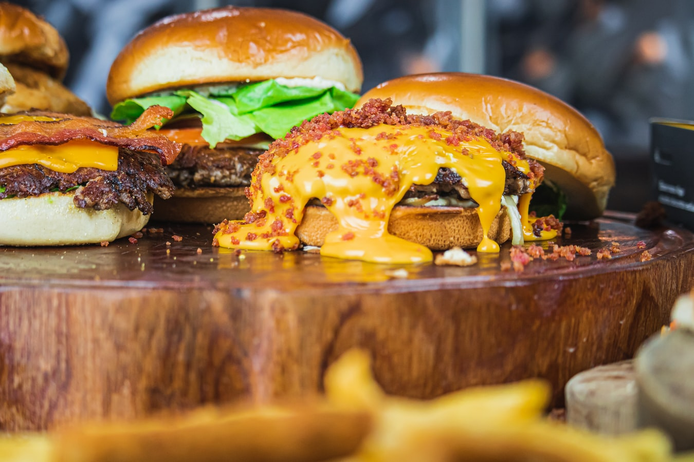

Plant-based diets can prevent and reverse high cholesterol, heart disease and diabetes. In children, they can decrease the risk for the common cold, ear infections and intestinal problems. They can decrease the risk for eczema, allergies and asthma. They decrease the risk for many types of cancer. They can improve mood and decrease the risk for Alzheimer's, depression and anxiety. They can prevent and treat acne. More people are learning about plant-based diets thanks to documentaries such as ["Forks Over Knives"](https://www.forksoverknives.com/) and books like ["How Not to Die"](https://nutritionfacts.org/book/how-not-to-die/). While the recommendations in this and similar documentaries and books present an all or nothing approach, making small step-by-step changes can be very helpful for our children's health. **It doesn't have to be all or nothing** My goal in this post is to present the health benefits of a plant-centered diet and emphasize the safety of a well-planned plant-based diet for children of all ages. # **I truly believe that the BEST GIFT we can give our children is healthy nutrition from the start! I am a pediatrician because I strongly believe in prevention, and healthy nutrition is the best way to prevent most chronic diseases.**

===========

`youtube: https://https://www.youtube.com/watch?v=O7ijukNzlUg`

# Children Who Eat the Standard American Diet Have Fatty Streaks (Atherosclerosis) by Age 10. These Fatty Streaks Lead to Heart Disease

Dr. Michael Gregor discusses the evidence behind plant-based nutrition and has a wealth of information on his web site, [nutritionfacts.org](nutritionfacts.org).

`youtube: https://https://www.youtube.com/watch?v=vlubvTMLrLM&feature=youtu.be`

So we can eat predominantly plants and lower our risk for chronic diseases while simultaneously improving planetary health. But don't kids need to drink their milk to grow? Actually, no. The WHO and UNICEF recommend breastfeeding until age 2 or longer

When my daughters were 12 months old, I felt uncomfortable fully transitioning to cow’s milk, so I continued to breastfeed while also supplementing with some cow’s milk. I loved breastfeeding and continued until both of my girls were 2 and a half years old. I did this to give my girls emotional support and connection more so than for nutritional reasons. Despite the fact that the WHO and UNICEF recommend breastfeeding until age 2 or longer, since I have always lived in the US, I was not focused on long-term breastfeeding for nutrition.

The United States, along with many other Western countries with strong dairy industries, promotes dairy as part of a healthy diet. **Dairy (along with fruits, vegetables, grains and protein) is part of the USDA [my plate](https://www.choosemyplate.gov/), and I never thought to question it.** However, as I started to learn more about plant-based nutrition, I came across the [Canadian government's nutrition guidelines](https://food-guide.canada.ca/en/).

In Canada, the food groups are vegetables and fruits, grains and protein with water to drink. [Frank Oski](https://en.wikipedia.org/wiki/Frank_Oski), a well-renowned pediatrician (the Oski of _Oski’s Pediatrics_--a popular pediatrics textbook, former chair of Pediatrics at Johns Hopkins Medical School, and a founder and editor of the Contemporary Pediatrics journal) wrote a book in 1977 called [Don’t Drink Your Milk](https://www.amazon.com/Dont-Drink-Your-Milk-Frank/dp/1479601659). He also worked collaboratively with the famous [Dr. Benjamin Spock](https://en.wikipedia.org/wiki/Benjamin_Spock) and the [Physicians Committee for Responsible Medicine](https://www.pcrm.org/good-nutrition/nutrition-for-kids) to [criticize the dairy industry](https://greensboro.com/dr-spock-leads-criticism-dairy-industry-denies-charge-that-milk-is-bad-for-children/article_8c6c1569-36a6-5e1a-9532-1d54131bca2c.html).

Dr. Oski's book illuminated several key points about cow's milk consumption:

1. Evolutionarily, we are not designed to drink milk past the age of natural weaning. In many countries around the world, mothers breast feed until age 2 or older (as is recommended by the CDC), and then children are weaned to a diet with plant-based foods and water. As a species, we have evolved to digest lactose due to our reliance on cattle farming. But for much of the world's population, lactose intolerance is the norm rather than the exception.

2. Data suggest that consuming cow's milk protein may increase a child's risk of developing allergic diseases like eczema and asthma. [A 2016 European study found that "In high risk infants, diet in infancy influences subsequent risk of atopy and asthma in young adulthood."](https://erj.ersjournals.com/content/48/suppl_60/PA4586).

3. Cow's milk protein intolerance is quite common, and can manifest in infancy as colic, reflux, diarrhea, blood-flecked stools, and poor growth. As children grow, cow's milk protein intolerance may play a role in chronic constipation and abdominal pain. In my personal practice, I often suggest a dairy-free diet for breastfeeding mothers whose babies are struggling with excessive crying and/or reflux.

4. Cow's milk contributes to iron deficiency anemia because cow's milk is low in iron, and it interferes with iron's absorption in the intestine. Some children are also sensitive to cow's milk, and in these children, drinking cow's milk can induce bleeding in their intestines. If a child has iron deficiency anemia and cow's milk allergy, taking an iron supplement will not treat the anemia until that child stops drinking cow's milk.
