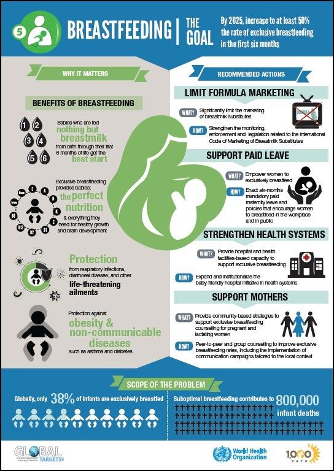
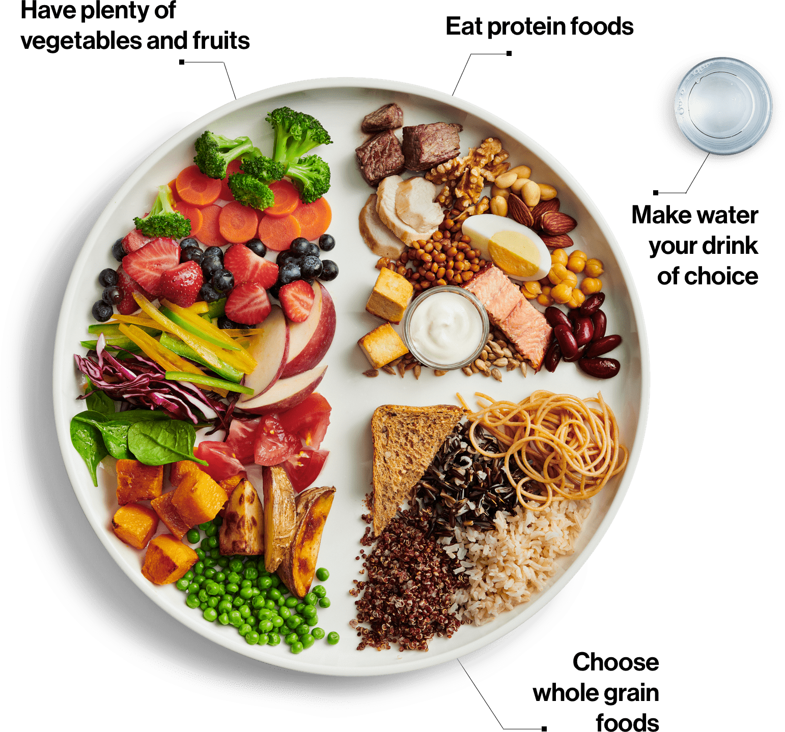
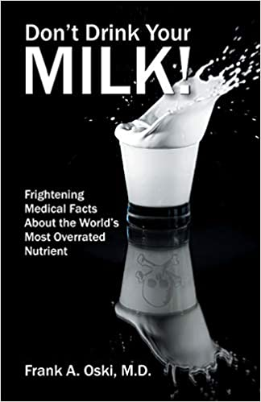

Always a tentative meat eater, I became a vegetarian during my junior year of college when I spent a semester in southern Mexico with the [School for International Training](https://www.sit.edu/). Of the five other students in my program, four were vegetarian, and I learned about the connection between our nutrition and the environment. Up until that semester, I hadn't met any vegetarians, and did not know that it is a healthy nutrition option.  **I was happy to learn that I could legitimately label my natural dietary tendencies, and stop apologizing for not liking meat.**

As I read more about vegetarian diets, I came across a book by [John Robbins](https://www.johnrobbins.info/) called Diet for a New World.  (Not coincidentally, John Robbins is the only son of the founder of the Baskin-Robbins ice cream empire).  In it, he discusses how the production of meat and dairy products negatively impacts the environment. 
I was astonished to learn how eating meat is an ENORMOUS contributor to [greenhouse gas emissions](https://interactive.carbonbrief.org/what-is-the-climate-impact-of-eating-meat-and-dairy/#:~:text=A%20taste%20for%20meat%20has,of%2015%2Dto%2D1.&text=Meat%20and%20dairy%20specifically%20accounts,and%20Agricultural%20Organization%20(FAO).) and global warming.

This diagram shows how food and agriculture production directly affects every aspect of environmental health

This was a major epiphany for me, and I passionately re-envisioned my personal and career goals. In fact, I returned to Duke University my junior year and changed my major from Biology to Religion, and learned more about [sustainable agriculture](https://www.ucsusa.org/resources/what-sustainable-agriculture).  I spent much of my senior year of college learning about what I now think of as [Lifestyle Medicine](https://www.lifestylemedicine.org/ACLM/About/What_is_Lifestyle_Medicine_/Lifestyle_Medicine.aspx)---the centrality of our lifestyle choices in promoting and maintaining our health.  Along with healthy nutrition, I focused on the benefits of yoga and mindfulness, regular exercise, and spiritual health.   

Twenty plus years, a husband and two kids later, I have just had another epiphany.  **While I have known a purely plant-based diet is healthiest for the environment, I was always told that plant foods do not provide “complete proteins.” I thought you had to have the proper ratio of rice and beans, etc, etc.  It always seemed too complicated and too impossible, so I continued eating dairy products and eggs.**  

When my daughters were 12 months old, I felt uncomfortable fully transitioning to cow's milk, so I continued to breastfeed while also supplementing with some cow's milk.  I loved breastfeeding and continued until both of my girls were 2 and a half years old.  I did this to give my girls emotional support and connection more so than for nutritional reasons. **Despite the fact that the [WHO and UNICEF recommend breastfeeding until age 2 or longer](https://www.who.int/news-room/fact-sheets/detail/infant-and-young-child-feeding#:~:text=WHO%20and%20UNICEF%20recommend%3A,years%20of%20age%20or%20beyond.), since I have always lived in the US, I was not focused on long-term breastfeeding for nutrition.**

The United States, along with many other Western countries with strong dairy industries, promotes dairy as part of a healthy diet. **Dairy (along with fruits, vegetables, grains and protein) is part of the USDA [my plate](https://www.choosemyplate.gov/), and I never thought to question it.**  

However, as I started to learn more about plant-based nutrition, I came across the [Canadian government's nutrition guidelines](https://food-guide.canada.ca/en/)?!!** 

Now, the groups are vegetables and fruits, grains and protein with water to drink.  [Frank Oski](https://en.wikipedia.org/wiki/Frank_Oski), a well-renowned pediatrician (the Oski of _Oski’s Pediatrics_--a popular pediatrics textbook, former chair of Pediatrics at Johns Hopkins Medical School, and a founder and editor of the Contemporary Pediatrics journal) wrote a book in 1977 called [Don’t Drink Your Milk](https://www.amazon.com/Dont-Drink-Your-Milk-Frank/dp/1479601659).  

He also worked collaboratively with the famous [Dr. Benjamin Spock](https://en.wikipedia.org/wiki/Benjamin_Spock) and the [Physicians Committee for Responsible Medicine](https://www.pcrm.org/good-nutrition/nutrition-for-kids) to [criticize the dairy industry](https://greensboro.com/dr-spock-leads-criticism-dairy-industry-denies-charge-that-milk-is-bad-for-children/article_8c6c1569-36a6-5e1a-9532-1d54131bca2c.html).  

I recently completed a course on [plant-based nutrition](https://nutritionstudies.org/courses/plant-based-nutrition/), and I hope to inspire you all to re-think what we eat and why. **I want to emphasize that thinking about changing our diets is HARD, and it doesn’t have to be 100%.** I just want to help raise awareness that the healthiest foods are whole foods and plant-based. I still get my girls pizza on occasion, and they love sour cream and cheese when we order burritos. We do this maybe once a week----I’m ok with that. I know that, for me, I have been feeling so much more energetic on a fully plant-based diet, but everyone has their own comfort levels. The more plant-based whole foods you can incorporate into your family’s diet, the healthier you will be. 
