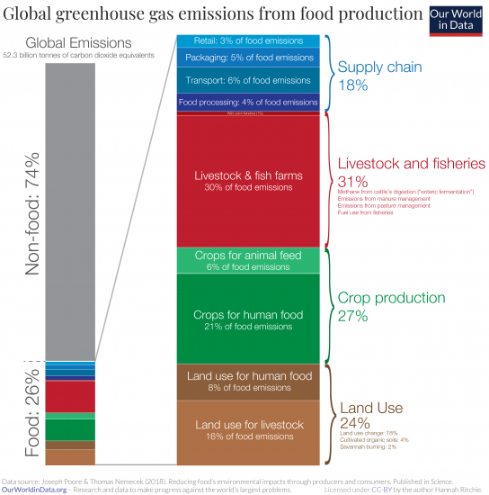
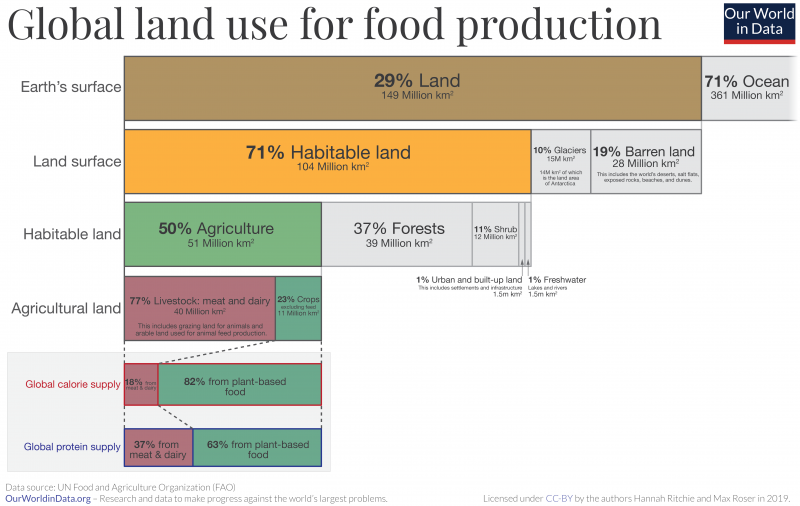
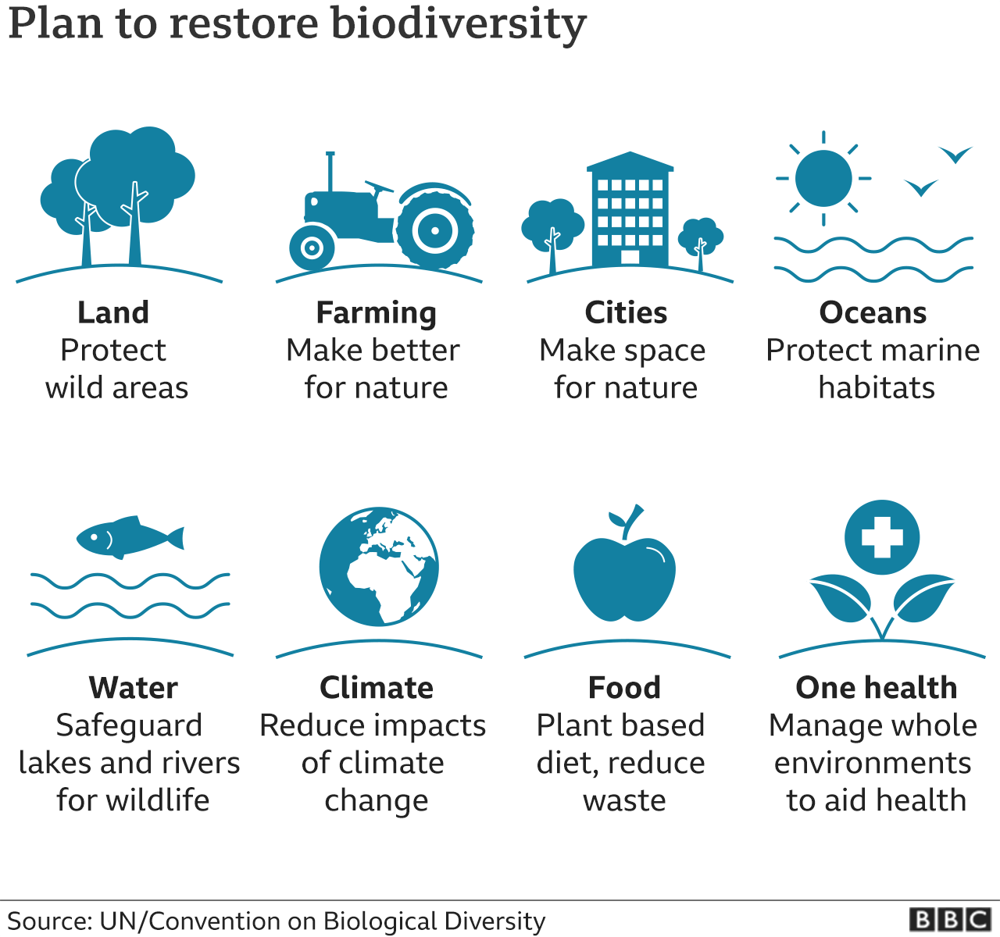

I am excited to share my thoughts with you about the health and environmental benefits of a whole foods plant based diet! First, I'd like to explain what I mean by a whole foods plant-based diet. Essentially, the goals are twofold:

- To eat mostly plant-based foods (fruits, vegetables, legumes and grains) and minimize or avoid animal based foods (beef, poultry, eggs, dairy, fish)
- To eat predominantly whole foods and avoid highly processed and sugary foods. This means limiting/avoiding eating food with more than five ingredients or ingredients that are hard to understand/pronounce

As an example of a whole foods plant-based diet, I would like to share [Canada's Nutrition Guidelines](https://food-guide.canada.ca/en/):

I hope to inspire you to re-think what we eat and why. **I want to emphasize that thinking about changing our diets is HARD, and it doesn’t have to be 100%.** The more whole plant-based foods you can incorporate and the more animal products you can limit, the better, but we have to do what is best for our individual families. My goal is to raise awareness that the healthiest foods are whole foods and plant-based. Eating a whole foods plant-based diet is safe and health-promoting for children of all ages, and is also a crucial part of slowing global warming. With the worsening California wildfires, we are seeing the direct consequences of a warming planet. As we all experienced in the Bay Area this and past summers, [the poor air quality limits our ability to be outside and exacerbates asthma and other respiratory issues](https://www.nytimes.com/interactive/2020/11/26/climate/california-smoke-children-health.html). **Changing our collective eating habits is a necessary step to slow global warming.** In this post, I would like to share what I have learned about the environmental benefits of eating a plant-based diet. My next two blog posts are about 1) The Health Benefits and Safety of a Plant-Based Diet for Children and 2) How to Feed Children a Plant-Based Diet.

Always a tentative meat eater, I became a vegetarian during my junior year of college when I spent a semester in southern Mexico with the [School for International Training](https://www.sit.edu/). It was easy to be vegetarian in Oaxaca: I learned that I loved black beans, freshly made corn tortillas, pico de gallo, and avocados. As I read more about vegetarian diets, I came across a book by [John Robbins](https://www.johnrobbins.info/) called Diet for a New World. Robbins details how the production of meat and dairy products negatively impacts the environment, as well as the health benefits of plant-based diets.

[Our World In Data](https://ourworldindata.org/environmental-impacts-of-food) clearly diagrams how food and agriculture production impacts our environment.

- [Food and agriculture production accounts for **26%** of global greenhouse gas emissions](https://ourworldindata.org/food-ghg-emissions)

- Half of the world’s habitable land is used for agriculture

- [70% of the world's freshwater consumption is used for agriculture](https://ourworldindata.org/water-use-stress), and this continues to increase over time.

- [Almost 80% of global ocean and freshwater pollution is due to food and agriculture production](https://foodprint.org/issues/how-industrial-agriculture-affects-our-water/)

- [Agriculture and aquaculture dramatically reduce the earth's biodiversity, and are the biggest contributors to further threatening endangered species. This BBC article illustrates why this is happening and what we can do to help](https://www.bbc.com/news/science-environment-54357899)

The [EAT-Lancet Commission on Food, Planet Health](https://eatforum.org/eat-lancet-commission/) asks, "Can we feed a future population of 10 billion people a healthy diet within planetary boundaries?" Their [report](https://eatforum.org/eat-lancet-commission/eat-lancet-commission-summary-report/) details how a diet rich in plants and lower in animal sources is both healthier and environmentally sustainable.

> "Transformation to healthy diets by 2050 will require substantial dietary shifts. Global consumption of fruits, vegetables, nuts and legumes will have to double, and consumption of foods such as red meat and sugar will have to be reduced by more than 50%. A diet rich in plant-based foods and with fewer animal source foods confers both improved health and environmental benefits."

`youtube: PIc42oIU0Ik`

I have started talking to my nine year old daughter about the environmental benefits of eating a plant-based diet. Since she was a baby, we have fed her a variety of fruits and vegetables. She eats most of what I cook, and I'm sure she would like it even more if I improved my cooking skills! She did a report last year on [Greta Thunberg](https://en.wikipedia.org/wiki/Greta_Thunberg), the now 17 year old Swedish environmental activist, and she hopes to start a Climate Change Club at her school. If we talk to our kids about the health and environmental benefits of eating more plants, they might be inspired learn more about plant-centered nutrition.

Again, I want to emphasize that eating a plant-based diet doesn't mean completely cutting out all animal-based foods. The more plants we can incorporate into our diets, and the more animal foods we can cut out, the better.

`youtube: nUnJQWO4YJY`
