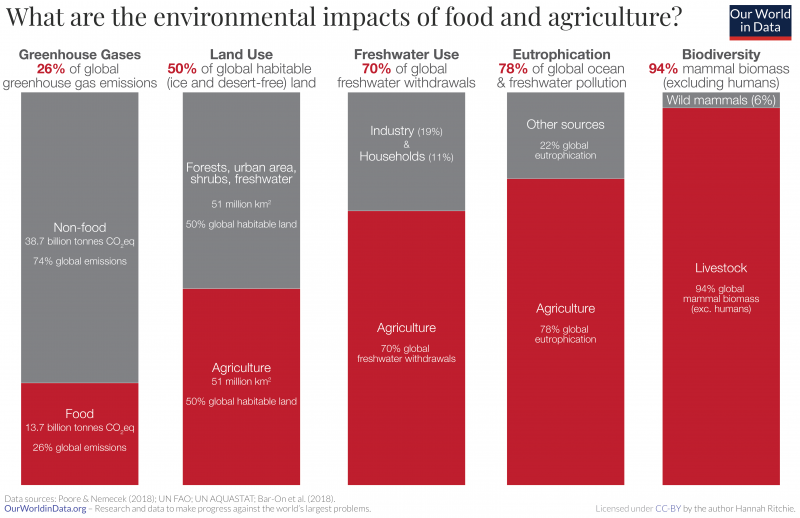
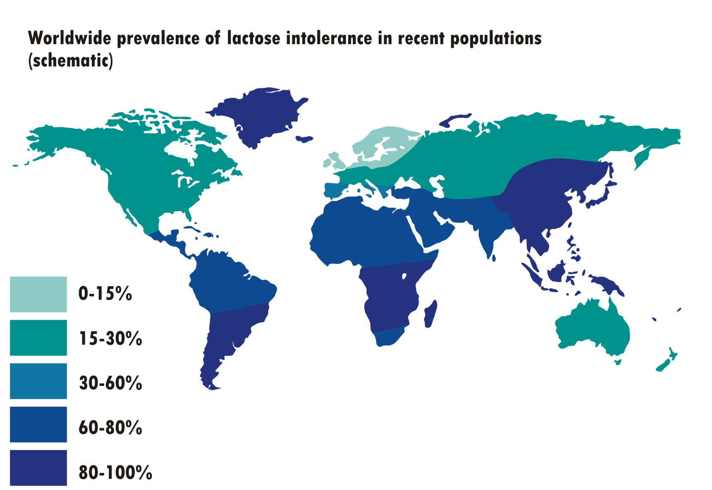

Always a tentative meat eater, I became a vegetarian during my junior year of college when I spent a semester in southern Mexico with the [School for International Training](https://www.sit.edu/).  It was easy to be vegetarian in Oaxaca: I learned that I loved black beans, freshly made corn tortillas, pico de gallo, and avocados.  As I read more about vegetarian diets, I came across a book by [John Robbins](https://www.johnrobbins.info/) called Diet for a New World.  Robbins details how the production of meat and dairy products negatively impacts the environment, as well as the health benefits of plant-based diets.  

This diagram shows how food and agriculture production directly affects environmental health

The [EAT-Lancet Commission on Food, Planet Health](https://eatforum.org/eat-lancet-commission/) asks, "Can we feed a future population of 10 billion people a healthy diet within planetary boundaries?"  Their [report](https://eatforum.org/eat-lancet-commission/eat-lancet-commission-summary-report/) details how a diet rich in plants and lower in animal sources is both healthier and environmentally sustainable. 

> "Transformation to healthy diets by 2050 will require substantial dietary shifts. Global consumption of fruits, vegetables, nuts and legumes will have to double, and consumption of foods such as red meat and sugar will have to be reduced by more than 50%. A diet rich in plant-based foods and with fewer animal source foods confers both improved health and environmental benefits."

`youtube: PIc42oIU0Ik`

As I learn more about whole food plant-based nutrition, I am increasingly questioning the health benefits of cow's milk and other dairy products.  The United States, along with many other Western countries with strong dairy industries, promotes dairy as part of a healthy diet. **Dairy (along with fruits, vegetables, grains and protein) is part of the USDA [my plate](https://www.choosemyplate.gov/), and I never thought to question it.**  However, as I started to learn more about plant-based nutrition, I came across the [Canadian government's nutrition guidelines](https://food-guide.canada.ca/en/).

In Canada, the food groups are vegetables and fruits, grains and protein with water to drink.  [Frank Oski](https://en.wikipedia.org/wiki/Frank_Oski), a well-renowned pediatrician (the Oski of _Oski’s Pediatrics_--a popular pediatrics textbook, former chair of Pediatrics at Johns Hopkins Medical School, and a founder and editor of the Contemporary Pediatrics journal) wrote a book in 1977 called [Don’t Drink Your Milk](https://www.amazon.com/Dont-Drink-Your-Milk-Frank/dp/1479601659).  He also worked collaboratively with the famous [Dr. Benjamin Spock](https://en.wikipedia.org/wiki/Benjamin_Spock) and the [Physicians Committee for Responsible Medicine](https://www.pcrm.org/good-nutrition/nutrition-for-kids) to [criticize the dairy industry](https://greensboro.com/dr-spock-leads-criticism-dairy-industry-denies-charge-that-milk-is-bad-for-children/article_8c6c1569-36a6-5e1a-9532-1d54131bca2c.html).  

Dr. Oski's book illuminated several key points about cow's milk consumption:

1. Evolutionarily, we are not designed to drink milk past the age of natural weaning. In many countries around the world, mothers breast feed until age 2 or older (as is recommended by the CDC), and then children are weaned to a diet with plant-based foods and water. As a species, we have evolved to digest lactose due to our reliance on cattle farming.  But for much of the world's population, lactose intolerance is the norm rather than the exception. 

2. Data suggest that consuming cow's milk protein may increase a child's risk of developing allergic diseases like eczema and asthma. [A 2016 European study found that "In high risk infants, diet in infancy influences subsequent risk of atopy and asthma in young adulthood."](https://erj.ersjournals.com/content/48/suppl_60/PA4586). 

3. Cow's milk protein intolerance is quite common, and can manifest in infancy as colic, reflux, diarrhea, blood-flecked stools, and poor growth. As children grow, cow's milk protein intolerance may play a role in chronic constipation and abdominal pain. In my personal practice, I often suggest a dairy-free diet for breastfeeding mothers whose babies are struggling with excessive crying and/or reflux.

I recently completed a course on [plant-based nutrition](https://nutritionstudies.org/courses/plant-based-nutrition/), and I hope to inspire you all to re-think what we eat and why. **I want to emphasize that thinking about changing our diets is HARD, and it doesn’t have to be 100%.** I just want to help raise awareness that the healthiest foods are whole foods and plant-based. I still get my girls pizza on occasion, and they love sour cream and cheese when we order burritos. We do this maybe once a week----I’m ok with that. I know that, for me, I have been feeling so much more energetic on a fully plant-based diet, but everyone has their own comfort levels. The more plant-based whole foods you can incorporate into your family’s diet, the healthier you will be. 
